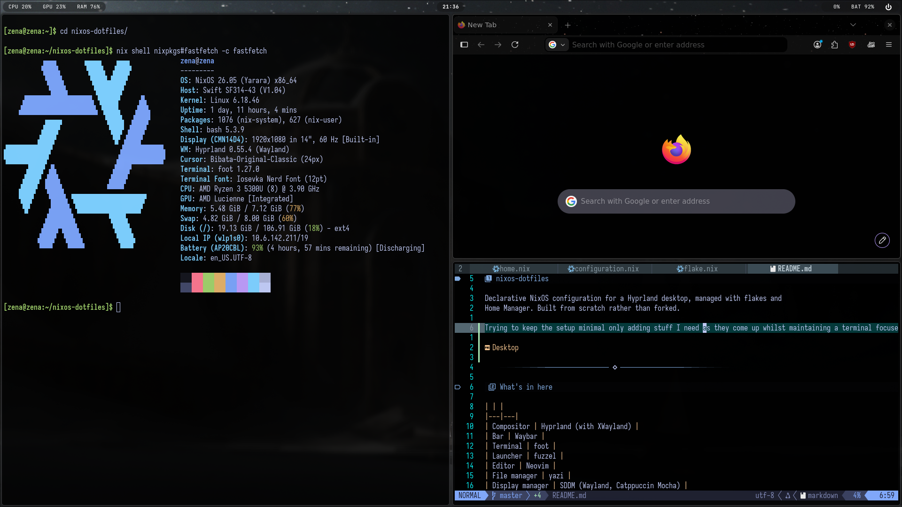

# nixos-dotfiles

Declarative NixOS configuration for a Hyprland desktop, managed with flakes and
Home Manager. Built from scratch rather than forked.

Trying to keep the setup minimal only adding stuff I need as they come up whilst maintaining a terminal focused workflow.



---

## What's in here

| | |
|---|---|
| Compositor | Hyprland (with XWayland) |
| Bar | Waybar |
| Terminal | foot |
| Launcher | fuzzel |
| Editor | Neovim |
| File manager | yazi |
| Display manager | SDDM (Wayland, Catppuccin Mocha) |
| Lock / idle | hyprlock, hypridle |
| Audio | PipeWire (ALSA, PulseAudio compat) |
| Shell | bash |

Boot is `systemd-boot` on EFI, networking via NetworkManager.

---

## Structure

```
nixos-dotfiles/
├── flake.nix                   # inputs, nixosConfigurations.zena
├── configuration.nix           # system-level config
├── hardware-configuration.nix  # generated, machine-specific
├── home.nix                    # user environment via Home Manager
└── config/                     # program configs, symlinked into ~/.config
    ├── hypr/
    ├── nvim/
    ├── waybar/
    ├── foot/
    └── fuzzel/
```

Anything Nix can express declaratively lives in `home.nix`; programs with their
own config languages keep their native files under `config/`.

---

## Out-of-store symlinks

`config/` is linked into `~/.config` with `mkOutOfStoreSymlink` rather than
copied into the Nix store:

```nix
create_symlink = path: config.lib.file.mkOutOfStoreSymlink path;

xdg.configFile = builtins.mapAttrs (name: subpath: {
  source = create_symlink "${dotfiles}/${subpath}";
  recursive = true;
}) configs;
```

Store paths are immutable, so the usual approach means a rebuild for every edit
to a Lua or TOML file. Pointing the symlink at the working tree instead means
changes under `config/nvim/` take effect immediately — normal iteration for
programs that reload their own config, with the tree still under version
control.

The tradeoff: these files aren't captured in a generation, so a system rollback
won't roll them back. Git covers that instead.

---

## Bluetooth audio roles

PipeWire's default `bluez5.roles` let the laptop present as an A2DP sink, so
headsets would connect as a *source* and WirePlumber would build an
audio-gateway profile with no sink no output node, no audio. Restricting the
roles fixes it:

```nix
wireplumber.extraConfig."51-bluez-roles" = {
  "monitor.bluez.properties" = {
    "bluez5.roles" = [ "a2dp_source" "hsp_ag" "hfp_ag" ];
  };
};
```

Trade-off: the laptop can no longer act as a speaker for a phone.

---

## Usage

Rebuild the system:

```bash
sudo nixos-rebuild switch --flake ~/nixos-dotfiles#zena
```

Aliased to `rebuild` in the bash config.

Update inputs:

```bash
nix flake update
```

Garbage collection runs weekly with a 30-day retention, and store optimisation
is automatic, so neither needs running by hand.

---

## Notes

Not intended as a drop-in configuration`hardware-configuration.nix` is
specific to this machine and the username is hardcoded in several places. More
useful as a reference for how the pieces fit together.
